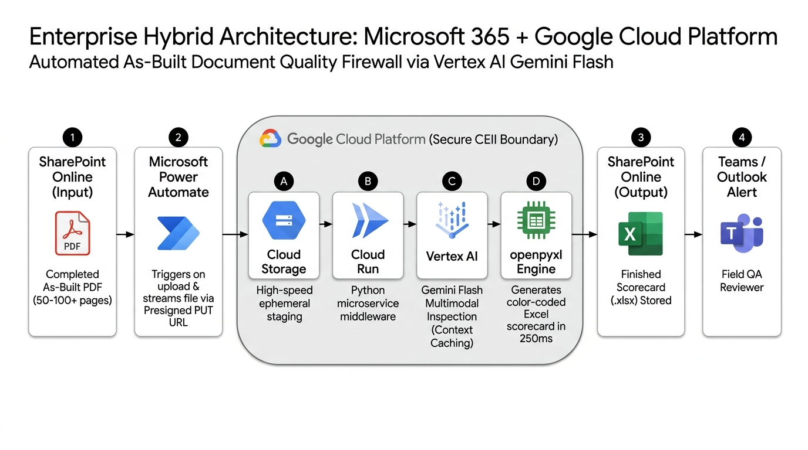

# Utility As-Built Quality Firewall: Customer Pilot Starter Kit
### Automated Multimodal Blueprint & Compliance Audit for Utility Construction Packages via Google Cloud Vertex AI (Gemini Flash)

---

## 📌 Executive Overview
This deployable starter kit provides a self-contained, turnkey solution for **Utility Infrastructure Contractors & Field Engineering Teams** to automate the quality control and pre-submission audit of high-density utility "As-Built" construction job packages (50 to 100+ page PDFs containing CAD drawings, redlines, GIS maps, trench profiles, BOM tables, and field photos).

By positioning **Google Cloud Vertex AI (Gemini Flash)** and **Cloud Run** as an asynchronous, high-speed **"Engine Room"** behind the Contractor's existing Microsoft 365 environment (SharePoint Online and Power Automate), field teams catch contractor "Go-Back" defects (e.g. missing California P.E. stamps, conduit footage discrepancies between plan drawings and BOM tables) in seconds before submitting packages to Pacific Gas & Electric (PG&E).

---

## ⚡ Key Architectural Capabilities



| Architecture Pillar | Core Engineering Mechanism | Business & Performance Impact |
| :--- | :--- | :--- |
| **Direct Streaming Middleware** | Issues Google Cloud Storage (GCS) V4 Presigned PUT URLs for direct client uploads. | Completely bypasses Power Automate's 120-second synchronous HTTP timeout and 100 MB message size limits for large 150 MB+ packages. |
| **Pure Gemini Flash Inspection** | Ingests native multimodal PDF vectors, visual redline layers, and stamps in a single inference pass. | Eliminates brittle Document AI OCR extraction and preserves 24" × 36" CAD sub-pixel line geometry. |
| **Vertex AI Context Caching** | Pins static utility reference handbooks and standard detail specifications in memory with 24-hour TTL. | Reduces repeated input token processing costs by up to 75% while decreasing time-to-first-token latency. |
| **Deterministic Generation** | Enforces JSON schema validation via Vertex AI `response_schema` controls. | Delivers reliable status enums (`PASS`, `FAIL`, `N/A`) alongside both physical 1-based PDF page index and printed drawing sheet number. |
| **Externalized Policy Engine** | Reads compliance definitions dynamically from `compliance_rules.yaml` or `.csv` spreadsheets in GCS. | Empowers non-technical QA leads and project managers to edit rules or adjust profiles with zero code redeployments. |
| **Sub-Second Scorecard Build** | Assembles styled, color-coded `.xlsx` workbooks directly in memory using Python `openpyxl`. | Delivers instant defect audit results in 250 milliseconds with zero Microsoft Graph API row-insertion throttling. |
| **Zero-Residue Data Purge** | Executes immediate programmatic `blob.delete()` cleanup backed by a 24-hour GCS lifecycle rule. | Guarantees zero long-term retention of critical infrastructure CAD blueprints within Google Cloud storage. |

---

## 📂 Repository Layout
```text
.
├── PILOT_IMPLEMENTATION_GUIDE.md      # Comprehensive Customer Onboarding & Integration Handbook
├── README.md                          # Repository overview and quickstart guide
├── LICENSE                            # Apache 2.0 License with Pilot Sample Code Disclaimer
├── Dockerfile                         # Production-slim Python 3.11 container for Cloud Run
├── requirements.txt                   # Pinned application dependencies
├── .env.example                       # Sanitized environment variable template
├── app/
│   ├── __init__.py
│   ├── main.py                        # FastAPI microservice (Presigned URLs, Audit, Rules, UI)
│   ├── evaluator.py                   # Pure Gemini Flash Multimodal Evaluator
│   ├── rules_loader.py                # Externalized YAML / CSV Rules & Policy Engine
│   ├── scorecard_builder.py           # openpyxl Styled Excel Scorecard Generator
│   └── schemas.py                     # Pydantic data schemas & controlled generation models
├── config/
│   ├── compliance_rules.yaml          # Master 17-check ruleset in clean YAML
│   ├── compliance_rules_template.csv  # Spreadsheet-friendly CSV template for QA teams
│   └── reference_docs/
│       └── README.md                  # Instructions for dropping static Job Aide PDFs for caching
├── deploy/
│   ├── setup_pilot.sh                 # 1-Click automated provisioning script for Google Cloud Shell
│   └── terraform/
│       ├── main.tf                    # Complete Terraform IaC (APIs, GCS, IAM, Cloud Run v2)
│       ├── variables.tf
│       └── outputs.tf
└── samples/
    ├── generate_sample_package.py     # Generates synthetic 3-page As-Built PDF with realistic defects
    ├── power_automate_flow_spec.json  # Reference Microsoft Power Automate flow definition
    └── test_pilot_e2e.sh              # End-to-end CLI validation script
```

---

## 🚀 Quickstart: Deploying the Pilot in 5 Minutes

### Step 1: Open Google Cloud Shell
1. Log in to the [Google Cloud Console](https://console.cloud.google.com/) using your corporate credentials.
2. Select your designated pilot project (e.g., `utility-asbuilt-pilot`).
3. Click the **Activate Cloud Shell** icon (top right terminal button).

### Step 2: Clone or Extract the Starter Kit
```bash
git clone <YOUR-REPO-URL> gcp-asbuilt-pilot-starter-kit
cd gcp-asbuilt-pilot-starter-kit
```

### Step 3: Run the 1-Click Provisioning Script
```bash
chmod +x deploy/setup_pilot.sh
./deploy/setup_pilot.sh
```
The script automatically:
* Enables `run.googleapis.com`, `aiplatform.googleapis.com`, `storage.googleapis.com`, and `cloudbuild.googleapis.com`.
* Provisions an ephemeral GCS bucket with CORS and 24-hour auto-purge lifecycles.
* Syncs `compliance_rules.yaml` to Cloud Storage.
* Creates the least-privilege service account `asbuilt-firewall-sa`.
* Builds and deploys the container to Cloud Run in `us-central1`.
* Outputs the live HTTPS service endpoint (e.g. `https://asbuilt-quality-firewall-xyz-uc.a.run.app`).

### Step 4: Run the End-to-End Pipeline Test
```bash
chmod +x samples/test_pilot_e2e.sh
./samples/test_pilot_e2e.sh https://<YOUR-CLOUD-RUN-URL>
```

### Step 5: Customize Compliance Rules to Your Liking (Important!)
> [!TIP]
> **Don't stay limited to the default 17 rules!** The pilot comes pre-configured with 17 baseline Go-Back checks, but the evaluation rules and reference policies are **completely externalized**. You can easily add, edit, or toggle rules for your own utility clients, municipal permits, or internal QA standards without touching Python code or redeploying Cloud Run:
> 
> * **Option A (YAML):** Edit [`config/compliance_rules.yaml`](config/compliance_rules.yaml) directly. Add new checks with your custom `name`, `category`, `evaluation_criteria`, and `remediation_template`.
> * **Option B (Excel / CSV):** Open [`config/compliance_rules_template.csv`](config/compliance_rules_template.csv) in Microsoft Excel to modify checks in a familiar spreadsheet format.
> * **To apply changes in Cloud Storage:**
>   ```bash
>   gcloud storage cp config/compliance_rules.yaml gs://<YOUR-BUCKET>/config/compliance_rules.yaml
>   curl -X POST https://<YOUR-CLOUD-RUN-URL>/api/rules/reload
>   ```
> * **Reference Job Aides:** Drop your utility partner's official PDF standards into `config/reference_docs/` for automatic Vertex AI Context Caching (saving up to 75% on repeated token costs).

---

## 🛠️ Testing Locally
```bash
# 1. Create virtual environment
python3 -m venv venv
source venv/bin/activate
pip install -r requirements.txt

# 2. Configure environment
cp .env.example .env

# 3. Start local development server
uvicorn app.main:app --reload --port 8080

# 4. Open interactive test dashboard
open http://localhost:8080
```

---

## 📋 Comprehensive Customer Implementation Guide
For click-by-click instructions on connecting **Microsoft Power Automate**, configuring **Vertex AI Context Caching**, managing **Rules & Policies**, and reviewing the **Pilot vs. Production Readiness Roadmap**, refer to [PILOT_IMPLEMENTATION_GUIDE.md](PILOT_IMPLEMENTATION_GUIDE.md).

---

## 📄 License & Disclaimer
Licensed under the Apache License, Version 2.0. This repository is delivered as sample reference code for pilot testing and demonstration.
